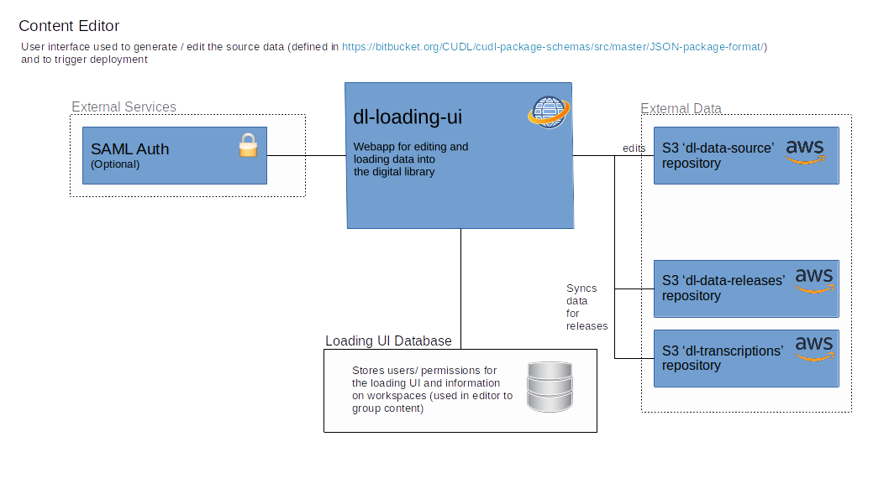

# Architecture Overview

CUDL is written in Java on Spring framework (CUDL-Viewer) with a JavaScript frontend
 (CUDL-Viewer-UI), PostgreSQL database, JSON metadata (CUDL-Data) and using XTF for 
 search (CUDL-XTF). Below is an overview of the application architecture:

