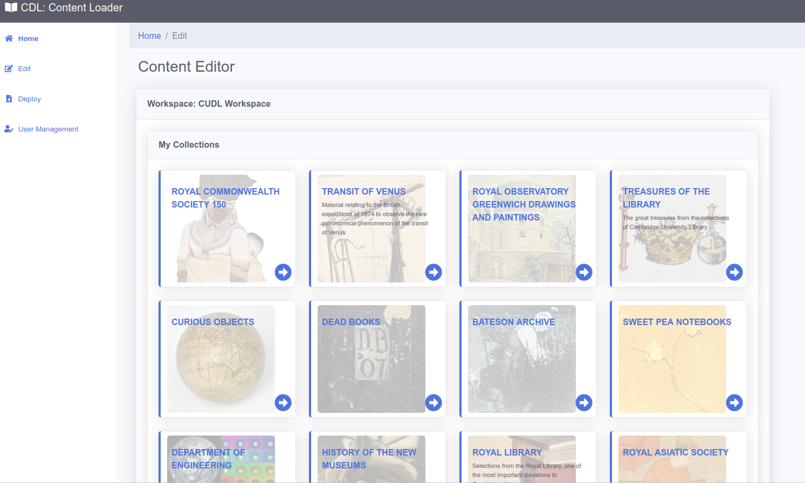
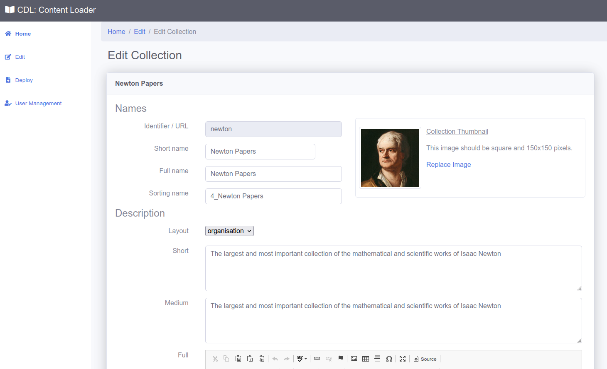
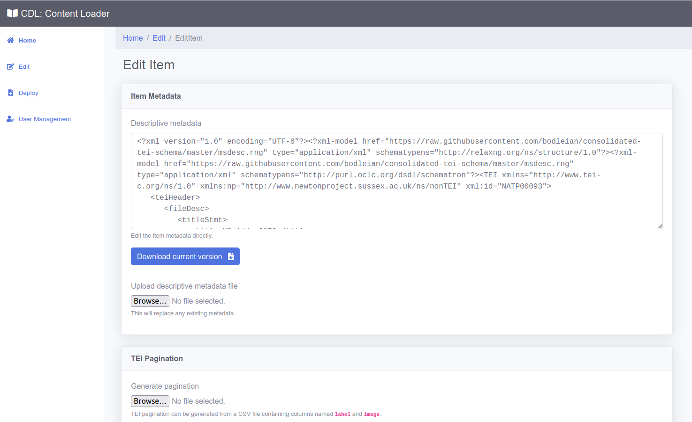
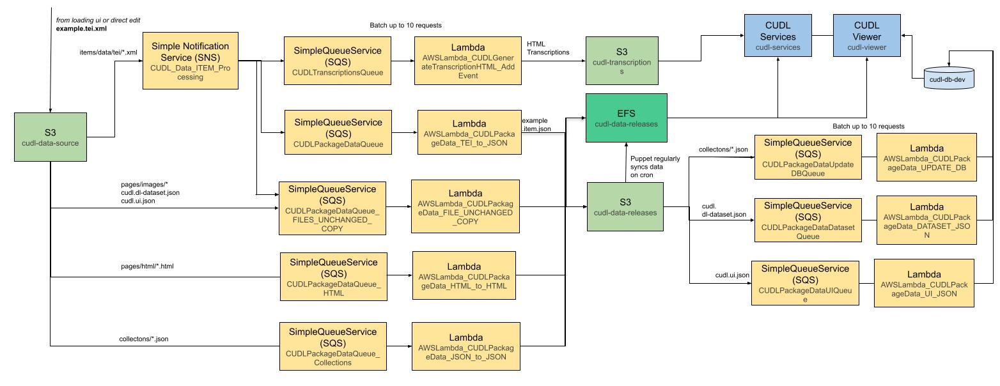

# Responsive Data Editing

## The metadata editor

In order to allow users to easily create and edit the content within the DL, we created the
Content Editor.  This provides an intuitive interface to edit Collections and Items.  It uses the
concept of Workspaces to allow content to be grouped, so that 
specific users can only edit items or collections in a specific workspace.

In this way we can have subject experts be able to contribute to the metadata and collection pages for items and opens up the 
Digital Library to allow a wider group to contribute content. 

These are some screenshots of the Editor:

A few seconds after any edits are made, the changes are viewable on the staging version of the viewer.  This
includes transcription, collection and item edits.  This allows users to easily and quickly view changes before publishing.

## Under the hood

The Java editor webapp that provides this interface can be found at:

[https://github.com/cambridge-collection/dl-loading-ui](https://github.com/cambridge-collection/dl-loading-ui)

The editor is directly connected to data in an S3 bucket, which means that as
soon as the data is saved, it takes only a couple of seconds for the data to be automatically 
converted from the stable and human readable source data format, into the format useable by the viewer.
It uses the process below:

The lambda code that performs the data conversion shown in yellow can be found here:

[https://github.com/cambridge-collection/data-lambda-transform](https://github.com/cambridge-collection/data-lambda-transform)

using the layer xslt data from here:

[https://github.com/cambridge-collection/cudl-data-processing-xslt](https://github.com/cambridge-collection/cudl-data-processing-xslt)

### Terraform
The process above, including the SNS, SQS, lambda functions etc can be created by running the Terraform script at:

[https://github.com/cambridge-collection/cudl-terraform](https://github.com/cambridge-collection/cudl-terraform)

There is separate configuration for creating dev, staging and production versions of the processing.

## Deployment 

The data is usually edited under the 'staging' version of the website, and so the data can be edited and then once 
ready to publish the data it can be deployed to live by just copying the data in the staging S3 data and transcription buckets
into the production buckets.  This is just done as a sync command in the content loader when the deploy 
button is pressed.  

It is controlled separately so only users specifically granted deployment permission can do this.

## Bulk Data Editing

It is not always sensible to individually edit items through an interface like this, in some cases we may want to 
script the ingest of item data, or bulk update items and collections.

In this case the source data follows the schema defined below:

[https://github.com/cambridge-collection/cudl-package-schemas/tree/main/JSON-package-format](https://github.com/cambridge-collection/cudl-package-schemas/tree/main/JSON-package-format)

Which has a file that lists the collections in the DL, and each collection file lists the items etc.  So it is quite easy to produce 
and contains all the information for the data within the DL in an easy to interpret text based folder of data.

When scripting or bulk editing you can then just produce the data in this format and write it directly to the S3 source bucket
and it will be processed as described above, in the exact same way as data edited through the content editor.