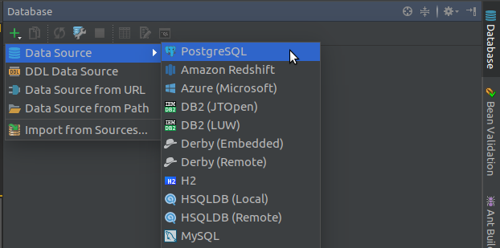
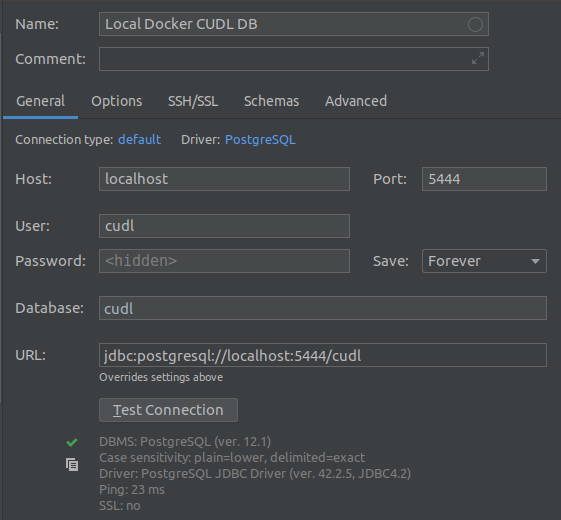

# Developing and Debugging the CUDL Viewer

## Connecting to the Local Database
   
   Running CUDL locally with Docker includes a PostgreSQL database container. If you wish, you can connect to this database to inspect it. The instructions given here are for doing so in IntelliJ IDEA, but you can use psql or any other tool you prefer in an equivalent way.
   
   Open the Database tab (tool window) on the right-hand side of IntelliJ IDEA and click the green plus button to add a new data source.
   
   
   Enter the connection information for the database as configured in docker-compose.yaml and (optionally) .env:
   
   
   If you do not specify CUDL_DB_HOST_PORT environmental variable, you may get a different port each time you start the container, which may be annoying.
   
   If prompted to do so, download the missing PostgreSQL driver, and click Ok.
   
   You will get a view in the Database tab of the tables. To see the contents of a table click the Data Editor button:
   
   
## Developing on CUDL-Viewer Code
   ### Run CUDL-Viewer After Changes
   
   When you make changes to the back-end Java code for CUDL-Viewer you need to rebuild and relaunch the app in order to see the changes. You can do this on the command line:
   
       $ mvn clean package
       $ docker-compose up
   
   Alternatively, you can set up a Run configuration in IntelliJ IDEA. In the top right-hand corner, click on the down arrow to Edit Configurations...
   
   
   In the dialog, click on the green + button and find 'Docker' > 'Docker-compose' in the list, and add the configuration:
   
   
   Click OK and now you will have a new run configuration set up. To run the app, click on the green arrow.
   
   
## Debugging CUDL-Viewer
   
   To debug the app using the debugger in IntelliJ IDEA:
   
   Add a breakpoint somewhere in the code by clicking to the right of a line number;
   Make sure the configuration 'Launch App' (or whatever you called it) is showing;
   Click the green bug icon;
   The debugger will open when the program hits your breakpoint (depending on where you put it).

   
   
## Developing on CUDL-Viewer-UI Code
   
   The JavaScript and CSS are managed in a separate repository (CUDL-Viewer-UI README) to the main Spring application, and built using Webpack. CUDL-Viewer-UI is pulled in by the CUDL-Viewer Maven build as a dependency from the CUDL Maven repository in the form of pre-built files (an artifact). Therefore, to actually develop on the CUDL-Viewer-UI code it is necessary to clone the original CUDL-Viewer-UI source, build it yourself and tell Maven to depend on your local version instead.
   Clone and Build the CUDL-Viewer-UI Code
   
   Clone the CUDL-Viewer-UI code into a new IntelliJ IDEA project and import it as a Maven project.
   
   Edit a file, open a Terminal in IntelliJ IDEA and run:
   
    $ mvn install
   
   This downloads all the necessary Maven dependencies and runs the Webpack build, which is equivalent to the command: `webpack.js -p --output-path /your/path/to/cudl-viewer-ui/target/webpack`
   
   You can create also create a Run Configuration for this command in IntelliJ IDEA.
   
## Linking the Local Build of CUDL-Viewer-UI to CUDL-Viewer
   
   In order for the CUDL-Viewer Maven build to depend on your local artifact of CUDL-Viewer-UI, you need to alter the CUDL-Viewer pom.xml file. (The pom.xml file lists all the dependencies managed by Maven.)
   
   First, find the CUDL-Viewer-UI pom.xml and find the project version, for example:
   
    <cudl-viewer-ui.version>2.0.0</cudl-viewer-ui.version>
   
   Then, go to the CUDL-Viewer pom.xml and change the cudl.viewer-ui-version to match, for example:
   
    <cudl-viewer-ui.version>2.0.2-SNAPSHOT</cudl-viewer-ui.version>
   
   Do not commit this change to the repo!
   
   Then rebuild and launch the CUDL-Viewer app.
   
   To check that Maven has correctly added the local CUDL-Viewer-UI dependency, click on the Maven Projects tab on the right-hand side of IntelliJ IDEA and open the Dependencies tree. It should say something like (with correct versioning):
   
   
## Alternative Approach
   
   The Webpack build can take several minutes, which can be annoying if you want to see the effect of small changes quickly. You may wish to set up a local Webpack dev server -- see the next section Setting Up Webpack Dev Server.
   Setting Up Webpack Dev Server (Optional but Recommended)
   
   Setting up a local Webpack dev server is optional, but useful for seeing live changes to your code without rebuilding manually every time. The official instructions are on the CUDL-Viewer-UI README.
   
### Install Node Version Manager (NVM)
   
   NVM is useful if you need to switch between different versions of nodeJS on your machine. You can install it using the official instructions NVM Installation and Update. Check that page to make sure you are installing the latest version rather than copy-pasting the line below.
   
    $ curl -o- https://raw.githubusercontent.com/nvm-sh/nvm/v0.35.3/install.sh | bash
   
### Install nodeJS
   
    $ nvm install 10.15.3
   
   If you already have this installed:
   
    $ nvm use 10.15.3
   
### Install WebPack and all other dependencies
   
    $ npm install -g webpack@^4.29.5 webpack-cli@^3.1.2 webpack-dev-server@^3.2.1 bower@^1.8.8 @babel/core@^7.3.4
   
### Run WebPack
   
    $ webpack-dev-server --config ./webpack.config.dev.babel.js --inline --hot
   
### Switch CUDL-Viewer to using the assets served by WebPack
   
   In CUDL-Viewer, in docker/cudl-global.properties change the cudl.ui.dev lines as below:
   
    cudl.ui.dev = true
    cudl.ui.dev.baseUrl = http://localhost:8080/
   
### Restart CUDL-Viewer
   
    $ mvn clean package
    $ docker-compose up

