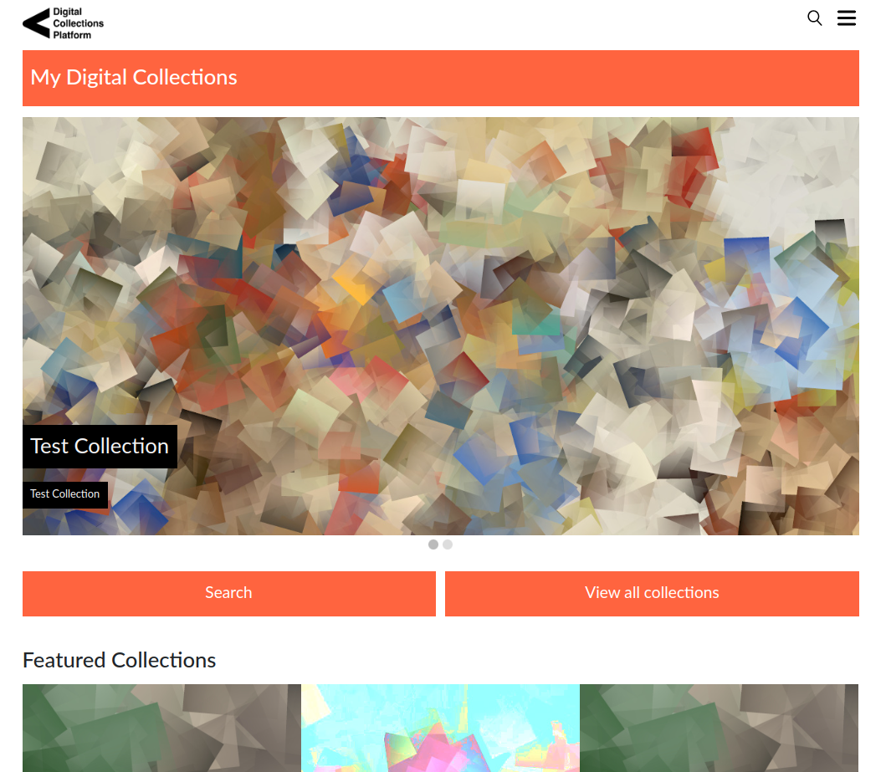

# Cambridge Digital Collection Platform Documentation

Welcome to the code repository for [Cambridge Digital Collection Platform](https://community.cdcp.info/space/CDCP/1900753/Cambridge+Digital+Collection+Platform). 

This houses the code for projects developed by the teams at the Cambridge University Library including
Cambridge Digital Collection Platform which underpins the [Cambridge Digital Library](https://cudl.lib.cam.ac.uk), 
[Manchester Digital Collections](https://www.digitalcollections.manchester.ac.uk/) and [Lancaster Digital Collections](https://digitalcollections.lancaster.ac.uk/)
among others. It is a platform that takes source metadata and images and 
provides a system for processing these into a website for display and discovery, 
with [IIIF](https://iiif.io) capability.

## What are all these repositories for?

Take a look at the
[architecture overview](arch-overview.md)
which shows the role of the different repositories and how they are connected. 

## Responsive Data Loading
The [content-editor](content-editor.md) shows how the data is loaded into the system in a responsive and easy to use system, so it can be previewed in seconds before publishing.

## Where do I get started?

First why not try out our viewer.  Take a look at our guide to [setting up a local viewer version](setup-local-viewer.md). 
This will get a local version of the platform on your local machine.

After you may want to look at the instructions on [setting up a local image server](setup-local-image-server.md).
and connecting it to the viewer.

If you want to look at installing a full version of the platform, we have [Terraform instructions](https://github.com/cambridge-collection/cudl-terraform)
which will setup the whole architecture with one command, on an AWS account. 

## Contributions
Why not help us out by getting involved and contributing, we welcome pull requests for code or documentation.  
Take a look at our [contribution guidelines for this project](../CONTRIBUTING.md).

## Contact Us
Email us with any questions to [dl-feedback@lib.cam.ac.uk](mailto:dl-feedback@lib.cam.ac.uk). 
