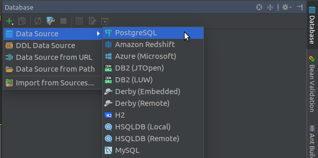
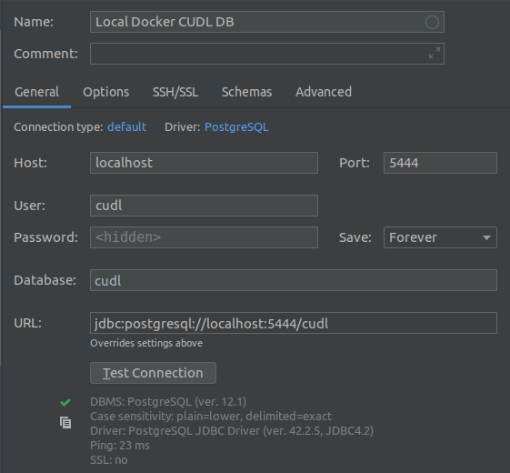
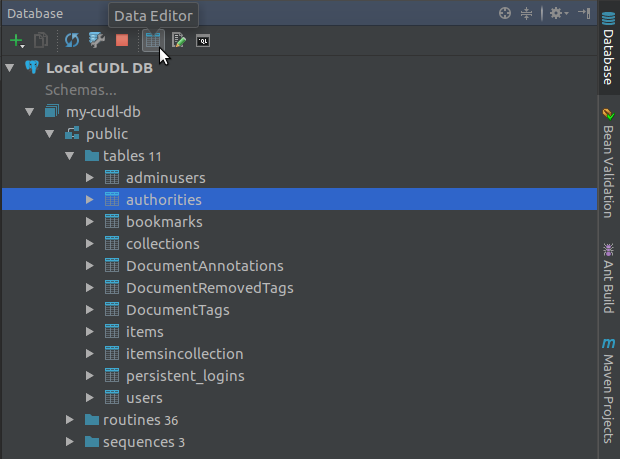
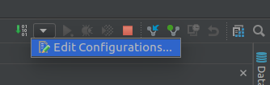
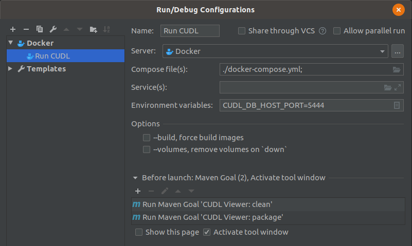
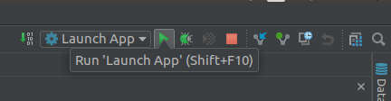
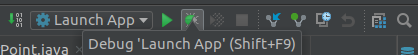
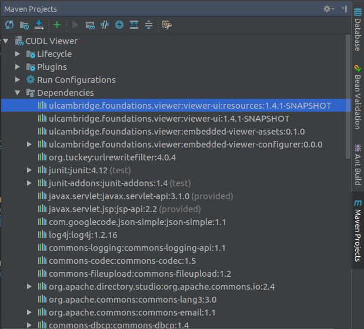

# Local Setup

## Before you start

Make sure you have the following installed:

- git

        $ sudo apt install git

This will get you the latest package that is supported by your OS version. In Ubuntu 18.04 (LTS) this will be quite 
out of date (v. 2.17.1). If you prefer to install the latest version of git following 
the instructions [here](https://itsfoss.com/install-git-ubuntu/).

- Java 8 JDK

        $ sudo apt-get install openjdk-8-jdk

Make sure the JAVA_HOME environmental variable points to your installation of openjdk-8-jdk. For example,
 add this line to your /etc/environment file (replacing the path with the path where your JDK is 
 installed):

    JAVA_HOME=/usr/lib/jvm/java-8-openjdk-amd64

- Apache Maven 3.1+

        $ sudo apt install maven

- Docker and Docker Compose

See the official instructions [Install Docker Engine - Community](https://docs.docker.com/engine/install/ubuntu/) and 
[Install Compose on Linux Systems](https://docs.docker.com/compose/install/#install-compose-on-linux-systems). 

## Dependencies
    
### JDK Maven Toolchain

To make sure that Java 1.8 is used to build the artefacts, you need to configure the location
 in the ~/.m2/toolchains.xml file:

    <?xml version="1.0" encoding="UTF8"?>
    <toolchains>
      <!-- JDK toolchains -->
      <toolchain>
        <type>jdk</type>
        <provides>
          <version>1.8</version>
          <vendor>openjdk</vendor>
        </provides>
        <configuration>
          <jdkHome>/usr/lib/jvm/java-8-openjdk-amd64</jdkHome>
        </configuration>
      </toolchain>
    </toolchains>

Replacing /usr/lib/jvm/java-8-openjdk-amd64 with the path where your version is installed. 

### Maven Dependencies

CUDL has its own Maven repository stored on AWS S3 where the CUDL-specific dependencies are stored for access by Maven.
At the moment this is restricted so dependencies, like cudl-viewer-ui and cudl-embedded-viewer need to be downloaded and 
build separately.

*[TODO  Setup public MVN repo with access to build versions of dependencies,
 so these do not need to be build separately. ]*

### Data dependencies

Data (TEI and JSON), some HTML content and images served by the image servers are not managed by Maven and their 
resources are configured in docker/cudl-global.properties for local development deployment. 
Ordinarily, you should not need to change this config to get the viewer running on your local machine. 

- Check out sample data repo: 

  https://github.com/cambridge-collection/dl-data-samples.git
  
  This is a small sample data set containing:
   - TEI
   - JSON
   - TIFF images (blank samples)
   - DATABASE export
   - HTML CONTENT
   
   
## Configuration

- Custom Configuration

    If you have checkout out the data repository at the same level as the viewer you should not need to 
    alter the configuration, however if you have a different setup you can use the environment variables: 
    
    - CUDL_VIEWER_CONFIG should point to local path for the file cudl-global.properties
    - CUDL_VIEWER_DATA should point to local path of cudl-data (containing JSON and Data subdirs)
    - CUDL_VIEWER_CONTENT should point to local path of cudl-viewer-content (HTML content) 
    - CUDL_DB_HOST_PORT port for the local db 
    
    See the docker-compose.yml for the default values for these.
    
    *[TODO: CUDL VIEWER branch 'sample-data-source' uses the sample data.  We probably want to 
    merge into master and add an extra file:cudl-defaults.env 
    to point to cudl data for Cambridge developers, etc]*

## Maven Build
   
   Open a shell on your machine, or a Terminal in IntelliJ IDEA. (If you cannot see the Terminal
   button in the bottom left-hand corner, hover over the square icon in the bottom left-hand corner
   and choose Terminal from the list.)
   
   
      
   To pull in dependencies and build a WAR file using Maven:
   
    $ mvn clean package
   
   The first time you do this may take some time as Maven will have to download lots of dependencies. This will create a compiled file /target/FoundationsViewer.war in your local Maven repository.
   Running the CUDL App
   
   The CUDL app is set up to run locally using Docker Compose. To run the app with the default configuration file docker-compose.yml:
   
    $ docker-compose up
   
   while in the project directory.
   
   (Legacy instructions: The CUDL-Viewer README gives instructions to use tomcat7 and cargo that no longer work.)
   *[TODO: Update README in viewer]*
   
   Access the app at http://localhost:8888/ and check that it is working.
   
## Connecting to the Local Database
   
   Running CUDL locally with Docker includes a PostgreSQL database container. If you wish, you can connect to this database to inspect it. The instructions given here are for doing so in IntelliJ IDEA, but you can use psql or any other tool you prefer in an equivalent way.
   
   Open the Database tab (tool window) on the right-hand side of IntelliJ IDEA and click the green plus button to add a new data source.
   
   
   Enter the connection information for the database as configured in docker-compose.yaml and (optionally) .env:
   
   
   If you do not specify CUDL_DB_HOST_PORT environmental variable, you may get a different port each time you start the container, which may be annoying.
   
   If prompted to do so, download the missing PostgreSQL driver, and click Ok.
   
   You will get a view in the Database tab of the tables. To see the contents of a table click the Data Editor button:
   
   
## Developing on CUDL-Viewer Code
   ### Run CUDL-Viewer After Changes
   
   When you make changes to the back-end Java code for CUDL-Viewer you need to rebuild and relaunch the app in order to see the changes. You can do this on the command line:
   
       $ mvn clean package
       $ docker-compose up
   
   Alternatively, you can set up a Run configuration in IntelliJ IDEA. In the top right-hand corner, click on the down arrow to Edit Configurations...
   
   
   In the dialog, click on the green + button and find 'Docker' > 'Docker-compose' in the list, and add the configuration:
   
   
   Click OK and now you will have a new run configuration set up. To run the app, click on the green arrow.
   
   
## Debugging CUDL-Viewer
   
   To debug the app using the debugger in IntelliJ IDEA:
   
   Add a breakpoint somewhere in the code by clicking to the right of a line number;
   Make sure the configuration 'Launch App' (or whatever you called it) is showing;
   Click the green bug icon;
   The debugger will open when the program hits your breakpoint (depending on where you put it).

   
   
## Developing on CUDL-Viewer-UI Code
   
   The JavaScript and CSS are managed in a separate repository (CUDL-Viewer-UI README) to the main Spring application, and built using Webpack. CUDL-Viewer-UI is pulled in by the CUDL-Viewer Maven build as a dependency from the CUDL Maven repository in the form of pre-built files (an artifact). Therefore, to actually develop on the CUDL-Viewer-UI code it is necessary to clone the original CUDL-Viewer-UI source, build it yourself and tell Maven to depend on your local version instead.
   Clone and Build the CUDL-Viewer-UI Code
   
   Clone the CUDL-Viewer-UI code into a new IntelliJ IDEA project and import it as a Maven project.
   
   Edit a file, open a Terminal in IntelliJ IDEA and run:
   
    $ mvn install
   
   This downloads all the necessary Maven dependencies and runs the Webpack build, which is equivalent to the command: `webpack.js -p --output-path /your/path/to/cudl-viewer-ui/target/webpack`
   
   You can create also create a Run Configuration for this command in IntelliJ IDEA.
   
## Linking the Local Build of CUDL-Viewer-UI to CUDL-Viewer
   
   In order for the CUDL-Viewer Maven build to depend on your local artifact of CUDL-Viewer-UI, you need to alter the CUDL-Viewer pom.xml file. (The pom.xml file lists all the dependencies managed by Maven.)
   
   First, find the CUDL-Viewer-UI pom.xml and find the project version, for example:
   
    <cudl-viewer-ui.version>2.0.0</cudl-viewer-ui.version>
   
   Then, go to the CUDL-Viewer pom.xml and change the cudl.viewer-ui-version to match, for example:
   
    <cudl-viewer-ui.version>2.0.2-SNAPSHOT</cudl-viewer-ui.version>
   
   Do not commit this change to the repo!
   
   Then rebuild and launch the CUDL-Viewer app.
   
   To check that Maven has correctly added the local CUDL-Viewer-UI dependency, click on the Maven Projects tab on the right-hand side of IntelliJ IDEA and open the Dependencies tree. It should say something like (with correct versioning):
   
   
## Alternative Approach
   
   The Webpack build can take several minutes, which can be annoying if you want to see the effect of small changes quickly. You may wish to set up a local Webpack dev server -- see the next section Setting Up Webpack Dev Server.
   Setting Up Webpack Dev Server (Optional but Recommended)
   
   Setting up a local Webpack dev server is optional, but useful for seeing live changes to your code without rebuilding manually every time. The official instructions are on the CUDL-Viewer-UI README.
   
### Install Node Version Manager (NVM)
   
   NVM is useful if you need to switch between different versions of nodeJS on your machine. You can install it using the official instructions NVM Installation and Update. Check that page to make sure you are installing the latest version rather than copy-pasting the line below.
   
    $ curl -o- https://raw.githubusercontent.com/nvm-sh/nvm/v0.35.3/install.sh | bash
   
### Install nodeJS
   
    $ nvm install 10.15.3
   
   If you already have this installed:
   
    $ nvm use 10.15.3
   
### Install WebPack and all other dependencies
   
    $ npm install -g webpack@^4.29.5 webpack-cli@^3.1.2 webpack-dev-server@^3.2.1 bower@^1.8.8 @babel/core@^7.3.4
   
### Run WebPack
   
    $ webpack-dev-server --config ./webpack.config.dev.babel.js --inline --hot
   
### Switch CUDL-Viewer to using the assets served by WebPack
   
   In CUDL-Viewer, in docker/cudl-global.properties change the cudl.ui.dev lines as below:
   
    cudl.ui.dev = true
    cudl.ui.dev.baseUrl = http://localhost:8080/
   
### Restart CUDL-Viewer
   
    $ mvn clean package
    $ docker-compose up

## Image Server

The image server that zoomable image tiles come from is configured in the cudl-global.properties
file. This can be altered by changing the IIIFImageServer and ImageServer properties.  
We are using the IIIF image server [IIPImage](https://iipimage.sourceforge.io/). 

    imageServer=https://images.lib.cam.ac.uk/
    IIIFImageServer=https://images.lib.cam.ac.uk/iiif/

