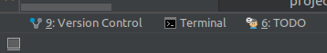

# Local Setup

## Before you start

These instructions assume you are running some flavour of Ubuntu. You may need to modify them if installing on another operating system.

Make sure you have the following installed:

- git

        $ sudo apt-get install git

This will get you the latest stable package that is supported by your OS version. If you prefer to install the latest version of git you could [install from the git PPA](https://itsfoss.com/install-git-ubuntu/)..

- Java 11 JDK

        $ sudo apt-get install openjdk-11-jdk

Make sure the `JAVA_HOME` environmental variable points to your installation of `openjdk-11-jdk`. For example,
 add this line to your `/etc/environment` file (replacing the path with the path where your JDK is 
 installed):

    JAVA_HOME=/usr/lib/jvm/java-11-openjdk-amd64

- Apache Maven 3.1+

        $ sudo apt-get install maven

- Docker and Docker Compose

Instructions to [Install Docker Engine on Ubuntu](https://docs.docker.com/engine/install/ubuntu/). Installation instructions for other operating systems are also available there. This will install Docker Engine, Docker CLI and the Docker Compose plugin. We don’t recommend that you use Docker Desktop for Linux, though this is probably fine for other operating systems.

## Dependencies
    
### JDK Maven Toolchain

To make sure that Java 11 is used to build the artefacts, you need to configure the location
 in the `~/.m2/toolchains.xml` file:

```
<?xml version="1.0" encoding="UTF8"?>
<toolchains>
    <!-- JDK toolchains -->
    <toolchain>
        <type>jdk</type>
        <provides>
            <version>11</version>
            <vendor>openjdk</vendor>
        </provides>
        <configuration>
            <jdkHome>/usr/lib/jvm/java-11-openjdk-amd64</jdkHome>
        </configuration>
    </toolchain>
</toolchains>
```

Replace `/usr/lib/jvm/java-8-openjdk-amd64` with the path where your version is installed. 

### Maven Dependencies

CUDL has its own Maven packages repository stored on GitHub where the CUDL-specific dependencies are stored for access by Maven. This is a public package repository and you should be able to download the dependencies.

You can setup the repo in your `~/.m2/settings.xml` file as follows:
    
```
<?xml version="1.0" encoding="UTF-8"?>
<settings xmlns="http://maven.apache.org/SETTINGS/1.0.0"
    xmlns:xsi="http://www.w3.org/2001/XMLSchema-instance"
    xsi:schemaLocation="http://maven.apache.org/SETTINGS/1.0.0> http://maven.apache.org/xsd/settings-1.0.0.xsd">
    <activeProfiles>
        <activeProfile>github</activeProfile>
    </activeProfiles>
    <profiles>
        <profile>
            <id>github</id>
            <repositories>
                <repository>
                    <id>central</id>
                    <url>https://repo1.maven.org/maven2</url>
                </repository>
                <repository>
                    <id>github</id>
                    <url>https://maven.pkg.github.com/cambridge-collection/*</url>
                    <snapshots>
                        <enabled>true</enabled>
                    </snapshots>
                </repository>
            </repositories>
        </profile>
    </profiles>
    <servers>
        <server>
            <id>github</id>
            <username>GITHUB_USERNAME</username>
            <password>GITHUB_PAT</password>
        </server>
    </servers>
</settings>
```

Now you will need to update this file to replace the `GITHUB_USERNAME` text with your own GitHub account username and replace the `GITHUB_PAT` text 
with a GitHub Personal Access Token (classic, not fine-grained) with repo and packages permissions. See [Creating a Personal Access Token (classic)](https://docs.github.com/en/authentication/keeping-your-account-and-data-secure/creating-a-personal-access-token).

## Setting up the viewer

- Check out cudl-viewer from:

  https://github.com/cambridge-collection/cudl-viewer.git

NOTE: If you have problems cloning the repo, you may need to comment out the
**[submodule "docker/db/snapshots"]** parts of the .gitmodules file.

Also, we recommend you use the **iiif_images_2023** branch from git as this one 
supports IIIF images in the main view winidow.  The main branch is still using dzi format
images which will be phased out soon.

### Setup sample data

Data (TEI and JSON), some HTML content and images served by the image servers are not managed by Maven and their
resources are configured in `docker/cudl-global.properties` for local development deployment.

Ordinarily, you should not need to change this config to get the viewer running on your local machine.

The sample data is linked as a git submodule of the cudl-viewer, so we need to initalise
it and download the data.  Do this with the following commands:

    $ git submodule init docker/db/dl-data-samples
    $ git submodule update --remote --merge docker/db/dl-data-samples

Check the git submodules are present: dl-data-samples should be at:

    docker/db/dl-data-samples

The sample data is a small sample data set containing:
   - TEI
   - JSON
   - TIFF images (blank samples)
   - DATABASE export
   - HTML CONTENT
   
  
### Maven Build   
   Open a shell on your machine, or a Terminal in your prefered IDE (e.g. IntelliJ IDEA).
   
   
      
   To pull in dependencies and build a WAR file using Maven:
   
    $ mvn clean package
   
   The first time you do this may take some time as Maven will have to download lots of dependencies. This will create a compiled file `/target/FoundationsViewer.war` in the CUDL-Viewer directory.

### Running the CUDL App
   
   The CUDL app is set up to run locally using Docker Compose. To run the app with the default configuration file `docker-compose.yml`:
   
    $ docker compose --env-file sample-data.env up
   
   while in the project directory.  
   
   If you have any problems look at the `sample-data.env` file
   and check that the variables `CUDL_VIEWER_DATA` and `CUDL_VIEWER_CONTENT` point to the paths within 
   your sample data set that you checked out in the previous step.
   
   Access the app at [http://localhost:8888/](http://localhost:8888/) and check that it is working.

## Image Server

The image server that zoomable image tiles come from is configured in the `cudl-global.properties`
file. This can be altered by changing the `IIIFImageServer` and `imageServer` properties.  
We are using the IIIF image server [IIPImage](https://iipimage.sourceforge.io/). 

    imageServer=https://images.lib.cam.ac.uk/
    IIIFImageServer=https://images.lib.cam.ac.uk/iiif/

## Using your own data

Once you have the viewer working on your system you can take a look at the sample
data. It's using under the directory `docker/db/dl-data-samples` where there
are two directories:

    source-data 
    processed-data

Inside the `source-data` directory the files use the format defined in 
[this schema](https://github.com/cambridge-collection/cudl-package-schemas/tree/main/JSON-package-format).
It will be the format which you use to define the collections and items with the digital library. For items
this contains TEI data.

The `processed-data` directory contains these files after they have been processed to be more suitable for the
viewer to read. You may notice for example the item data is now in json format. WARNING: the format of this 
data is likely to change over time as the viewer itself changes. 

To test out your data you may want to first have a look at the processed data to see how affects the viewer.  You can make
edits directly to this data and then perform the following commands to reset the data and load a fresh 

    docker-compose --env-file sample-data.env down
    docker image rm cudl-viewer_cudl-db:latest
    docker-compose --env-file sample-data.env up

you can then see what affect those changes have had.  You may want to temporarily 
convert some items to this JSON format for testing, and we have an XSLT script that does
this (link coming soon).

To use your own data in production we recommend you use convert your data into the format as defined in [this schema](https://github.com/cambridge-collection/cudl-package-schemas/tree/main/JSON-package-format) 
to prevent any problems if the processed-data format changes.  Once in this format you can have a look at the tools we have for 
converting this source-data into a processed form.  These tools are currently still being developed and more information will
be coming on setting up the data processing workflow.


## Further Information

For further information on debugging and developing using the cudl-viewer 
see [Developing and Debugging the Viewer](./developing-debugging-viewer.md).

For information on setting up a local image server see [Setting up a local image server](./setup-local-image-server.md).
